# Arduuinoによるプログラム開発の手引き（準備編）

この資料は、「INABA2023 ロボットカー」のプログラミンを行う（プログラム機能をかえる）ために必要になるAruduino IDEのセットアップについて説明したものです。

## 概要

「INABA2023 ロボットカー」はArduino(アルディーノ)というコンピュータシステムをつかってプログラミングしています。

Arduinoは、たとえば、芸術家や学生など、コンピュータが専門ではない人たちが、自分のアイデアを実現するために専門知識なしで、簡単に利用できるようデザインされたコンピュータシステムです。
スマホやパソコンを使って、プログラミングをすることによって簡単に利用できるようになっています。

[Arduino Home](https://https://www.arduino.cc/)

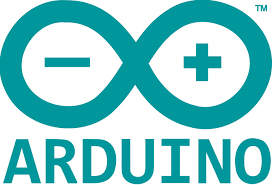

この資料は、以下の内容につて説明します。

- Arduino IDE (プログラム開発ツール)のセットアップ

- Arduino IDE の基本的な使い方

- 「INABA2023 ロボットカー」のプログラミングを行うために特別に必要な設定

> Arduinoを使ったプログラム開発は非常にポピュラーであり、インターネット上にもたくさん情報があります。  
>「INABA2023 ロボットカー」固有のこと以外は、インターネット上のサイトをいろいろ検索してみることをお勧めします。  
>（本資料の中でも、参考になるサイトのURLなどを紹介します）

## Arduino IDE (プログラム開発ツール)のセットアップ

Arduionoプログラムを作成したり、作成したプログラムをマイコンに転送したりするためのアプリケーションです。
Arduinoの本家ホームページからダインロードしてインストールします。

### プログラミングを始めるための環境準備

Arduino を使ったプログラミングを始めるためには、いくつかのアプリケーション(インターネットで入手できる)と、USBケーブル、そしてパソコンが必要になります。

### Arduino IDEのダウンロードとインストール

1. Arduino本家のソフトウェア配布ページからインストーラをダウンロードします。

[https://www.arduino.cc/en/software](https://www.arduino.cc/en/software)

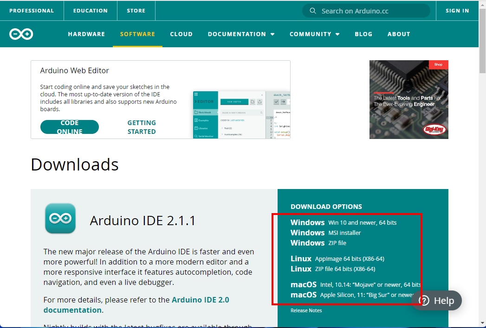

使っているパソコンの種類またはOSに応じてダウンロードしてください。

Windows10,11パソコンをお使いであれば、「WINDOWS Win 10 and newer, 64bits」でよいでしょう。

次のような画面が出ますので「JUST DOWNLOAD」をクリックして下さい。
（CONTRIBUTE & DOWNLOADで Arduinoプロジェクトに貢献(寄付)したい方はCONTRIBUTE...でもいいです。）

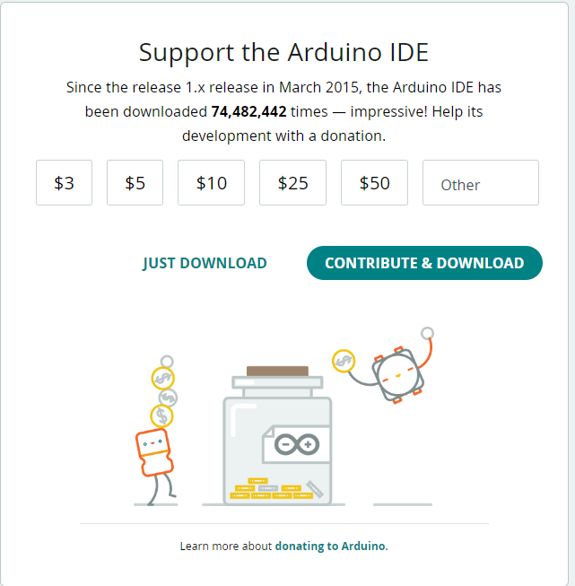

2. Arduino IDEのインストール

ダウンロードしたインストーラーを起動します。

「最初にライセンス契約書」の画面が出ますので、「同意する」ボタンを押し、あと数画面でオプションの設定を行うようになっていますが、特に必要がなければすべて表示された状態のまま「次へ」ボタンで進めてください。

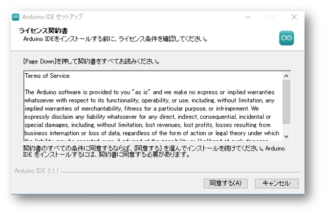

最後に次のような画面が表示されれば、インストールは成功です。

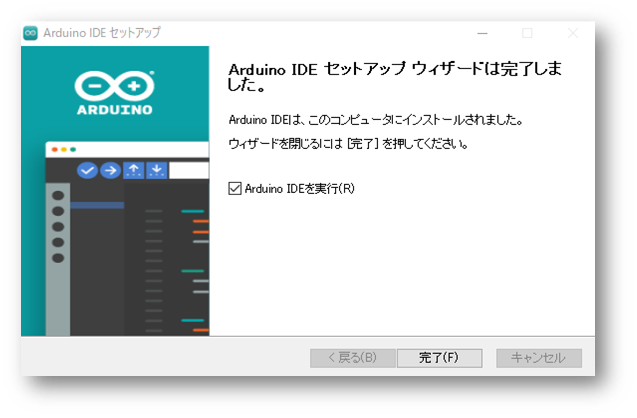

完了ボタンをクリックすると、Arduino IDEが起動します。
（最初の起動は、アップデートなどが実行されるため少し時間がかかります。）

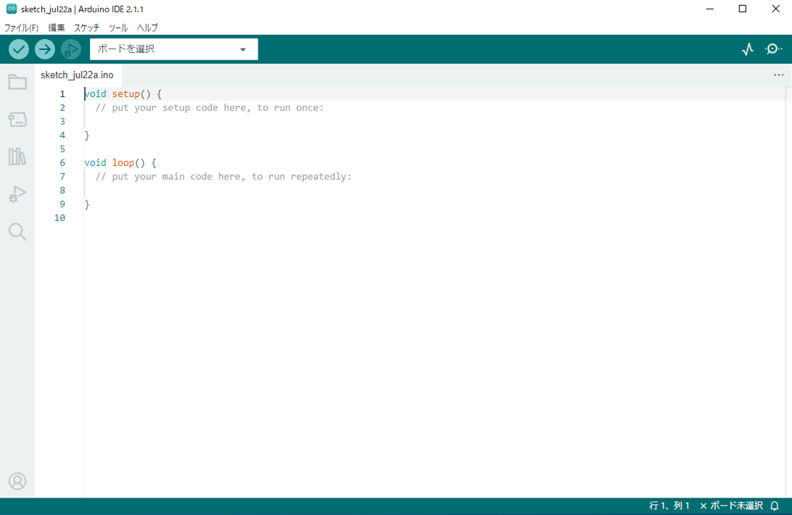

## 「INABA2023 ロボットカー」のプログラミングを行うために特別に必要な設定

Arduino IDEを使って「INABA2023 ロボットカー」のプログラミングを始めるためには、最初にいくつかやっておかなければならないことがあります。

> Arduino IDEはひとつのアプリで様々なタイプのマイコンのプログラミングができるようになっています。
> そのために、「ボードマネージャ」という仕組みで、使用するマイコンを選択できるようになっています。
> Arduino IDEに「INABA2023 ロボットカー」で使っているマイコン(ESP8266)のサポートを追加するためにここで設定を行います。　　
>※標準のArduino IEDにはESP8266のサポートは含まれていません

メニューから「ファイル」-> 「基本設定」をクリックしてください。

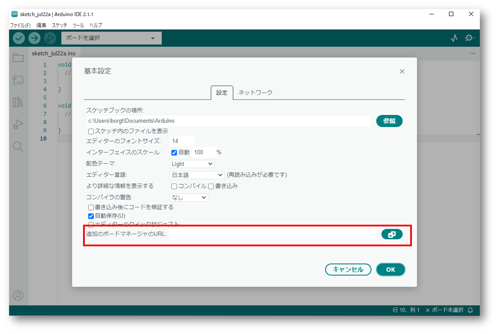

をクリックしてください。

追加のボードマネージャのURLに次のURLを追加して「OK」ボタンをクリック

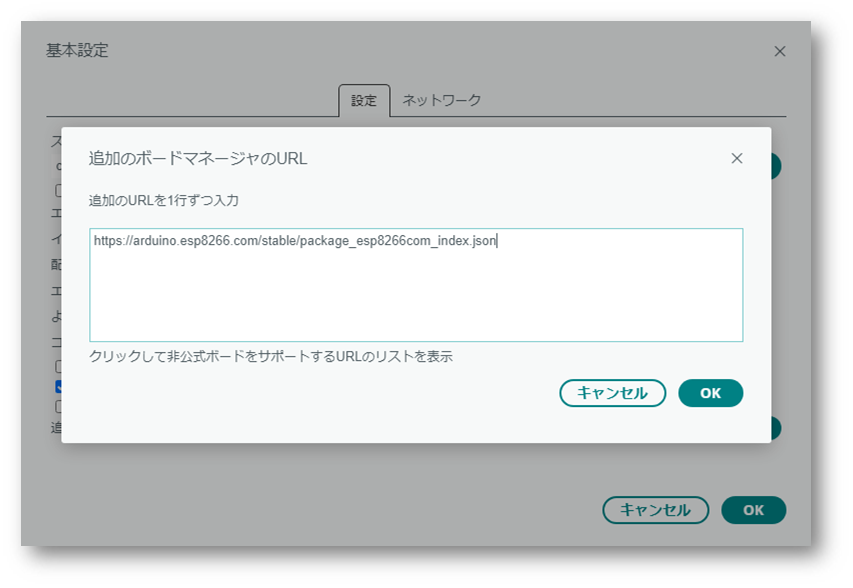

次に

メニューから「ツール」->「ボード」->「ボードマネージャ」をクリックしてください。

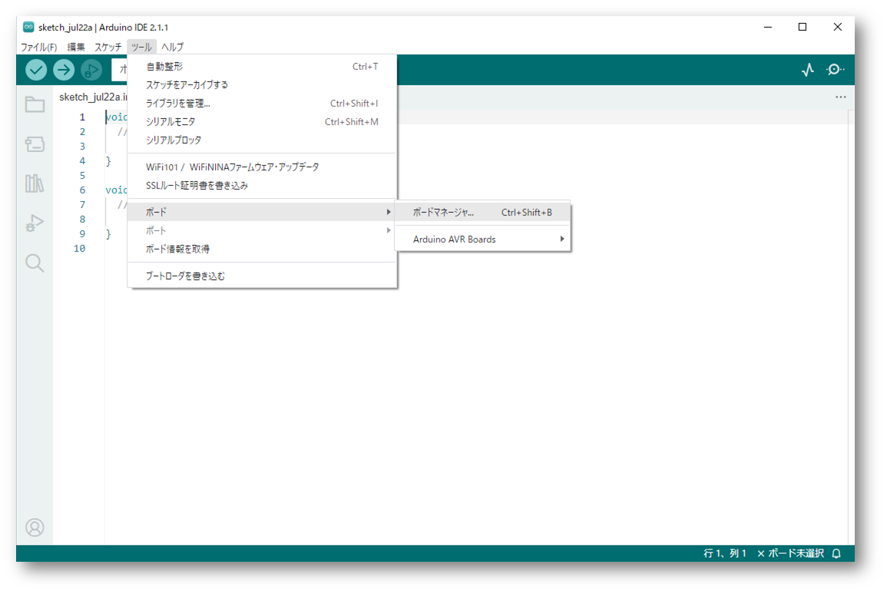

「ボードマネージャー」が開きArduino IDEがサポート可能なボード(マイコン)の一覧が表示されるので、そこからesp8266のボードを見つけて、インストールボタンをクリックしてください。

インストールボタンをクリックすると、esp8266用のサポートファイルがインターネットからダウンロードされ、Arduino IDEに追加されます。

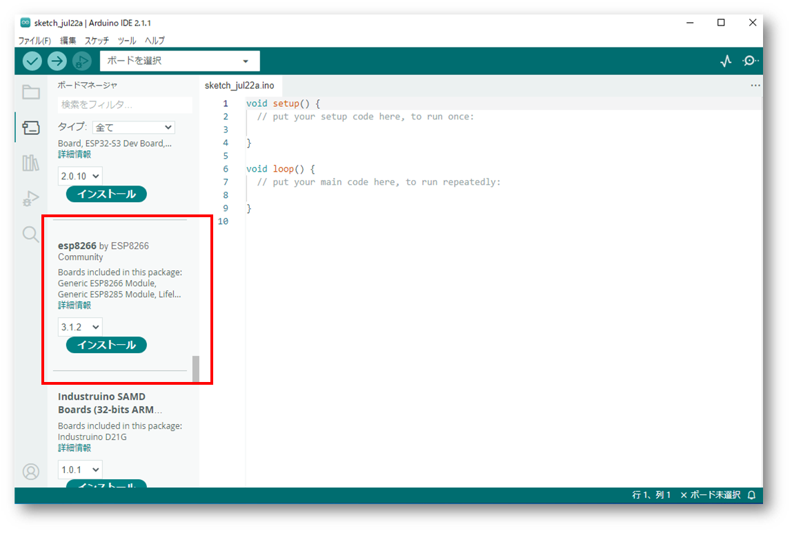

しばらくしてインストールが終われば、「ツール」ー＞「ボード」に「esp8266」が追加されているはずです。

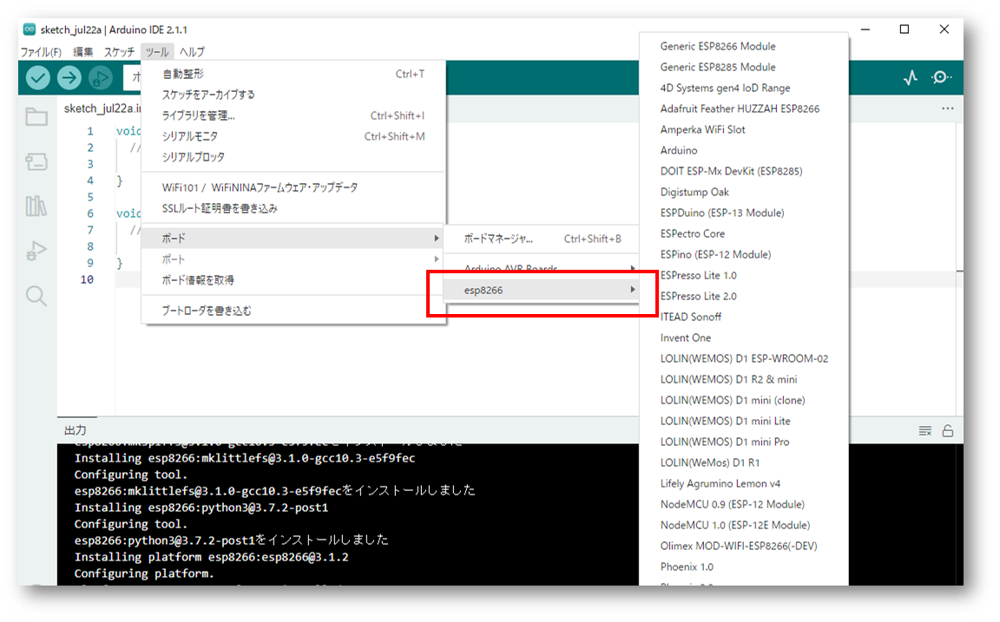

## Arduino IDE の基本的な使い方

セットアップが完了すると、このような画面が表示されているはずです。

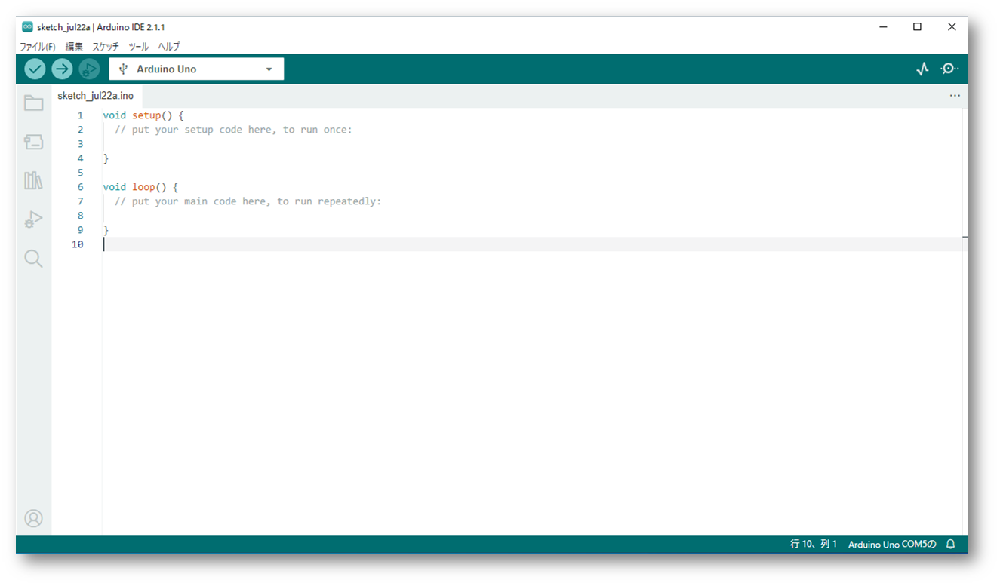

この部分が、テキストエディタになっており、ここにプログラムを書いていきます。
最初は、何もしない(BLANK)と呼ばれるプログラムが設定されています。
このテキストを修正して、自分の好きな処理を追加してゆくことになります。

Aruduinoではテキストで書かれたプログラムコードのことを「スケッチ」と呼びます。

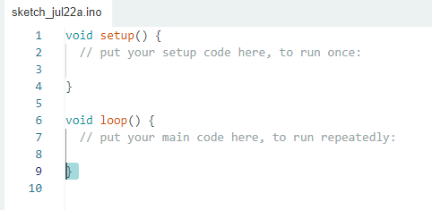

### Arduinoボード(マイコン)の接続

プログラムを作成するターゲットとなる「マイコン」をUSBケーブルで接続します。

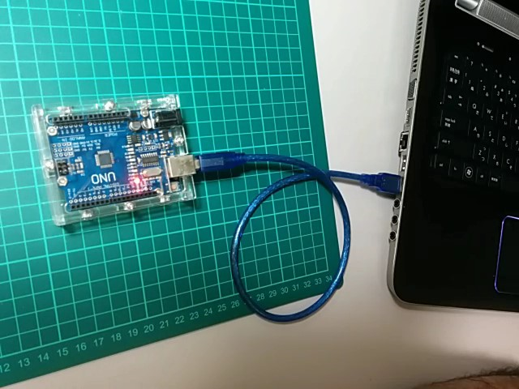

Arduino IDEによって「マイコン」が正しく認識されていれば、Arduino IDEの右下に、COMポート(シリアルポートの番号が表示されているはずです)

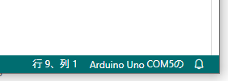 この場合はCOM5としてAruduinoボード(マイコン)が認識されています。

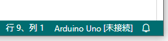 のように「未接続」と表示された場合は、ポート番号を調整する必要があります。

この場合には、メニューから「ツール」-> 「ポート」を選択してください。
Arduino IDEが認識しているシリアルポートの番号(この場合はCOM4)が表示されているはずなので、そこから選択してください。

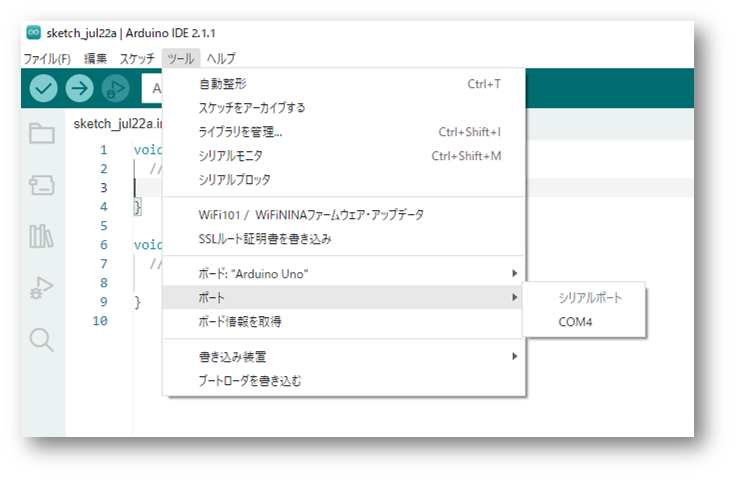

### ボード選択

つぎに、ボードの選択を行います。
Arduino IDEは様々なマイコン(ボード)に対応しているので、使用するマイコンに選択する必要があります。
使用するボードによってはポート(シリアルポート)を選択するだけで適切なボードを設定してくれる場合もありますが、必ず確認して違っていれば選択しなおしましょう。

>一度正しく選択すれば、作成したスケッチ(プログラムコード)を保存する際にその設定も一緒に保存されるので、改めて選択しなおす必要はありません。

ボードを選択するには、メニューから「ツール」->「ボード」のメニューをたどり、リストの中から使用するボードの種類を選択します。

この場合は「Arduino UNO」が選択されています。

利用するマイコンボードがリストにない場合もあります。
その場合には、「ボードマネージャ」の機能を使い、そのマイコンボードのサポートをArduino IDEに追加します。

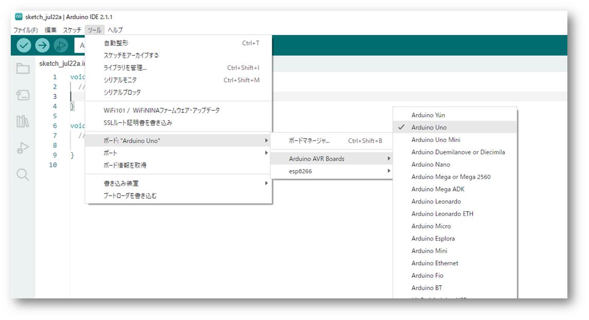

### プログラムの作成とマイコンボードへの書き込み

これで、プログラムを作成してマイコンに書き込みする準備が整いました。
本来は、テキストエディタの部分でスケッチを編集し、目的の機能を持ったプログラムを書き込みますが、とりあえず何もしない(BLANK)のプログラムをマイコンに書き込んでみましょう。

ツールバーにある書き込みボタンをクリックします。

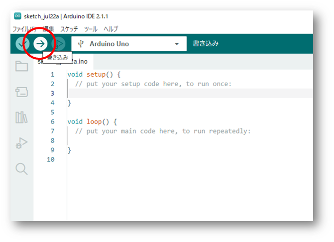

スケッチの検証とコンパイルが実行され、プログラムの問題がなければマイコンにプログラムが書き込まれます。
プログラムに問題があったり、マイコンとの接続(USBケーブル)に問題があるとエラーが表示され、マイコンへのプログラム書き込みは失敗します。
その場合は、表示されたエラー内容を確認し、スケッチの修正や、ケーブルの確認を行い、再度書き込みボタンを押します。

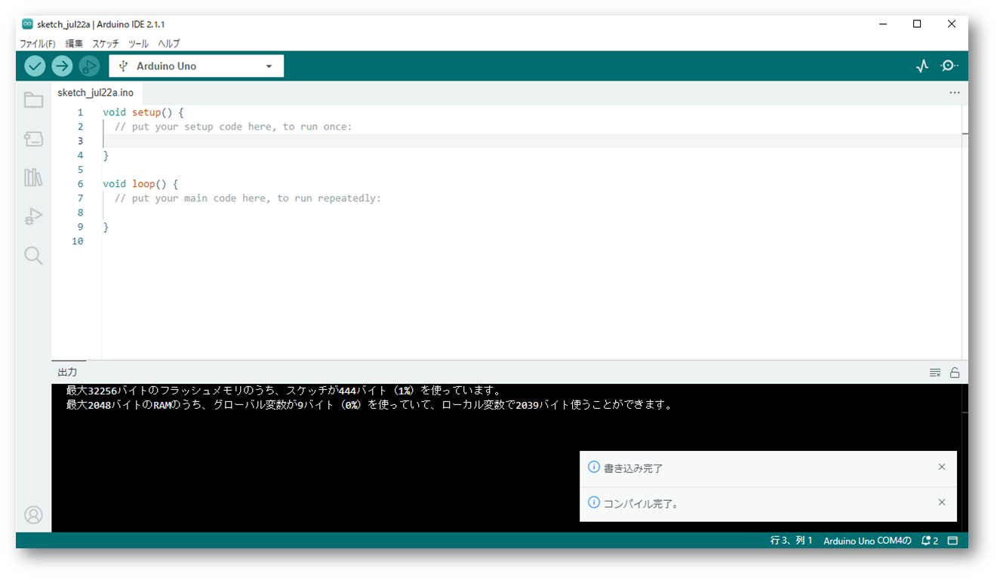

### スケッチ(プログラムコード)の保存

作成したスケッチ、あるいは作成中のスケッチはテキストファイルとして保存しておき、後日Aruduino IDEで読み込み、作業を再開することができます。

実は、スケッチをわざわざ保存しなくても、Arduino IDEはアプリケーションを終了するときに作業していたスケッチを自動で保存します。そして、次にArduino IDEを起動したときにはそれを自動的に開きます。

しかし、作成したスケッチは自分で、名前をつけて保存する習慣にしたほうが安全です。

作成中のスケッチを保存するには、メニューから「ファイル」->「保存」または「名前をつけて保存」をクリックします。

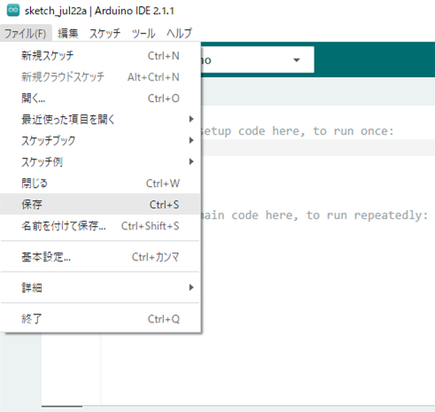

file保存のダイアログが表示されるので、保存場所とフォルダ名を指定して保存します。
arduino IDEは「新しいスケッチを作成」したり、「名前をつけて保存」するとき、自動で名前を作ります。この名前をそのまま使うと、なんのスケッチだったか後でわからなくなるので、自動生成された名前は、内容がわかり安い名前に変えてほぞんするようにしましょう。

スケッチの保存先は、標準では　Windowsのドキュメントフォルダの下のArduinoフォルダになるようですが、これは「ファイル」->「基本設定」で変更できます。

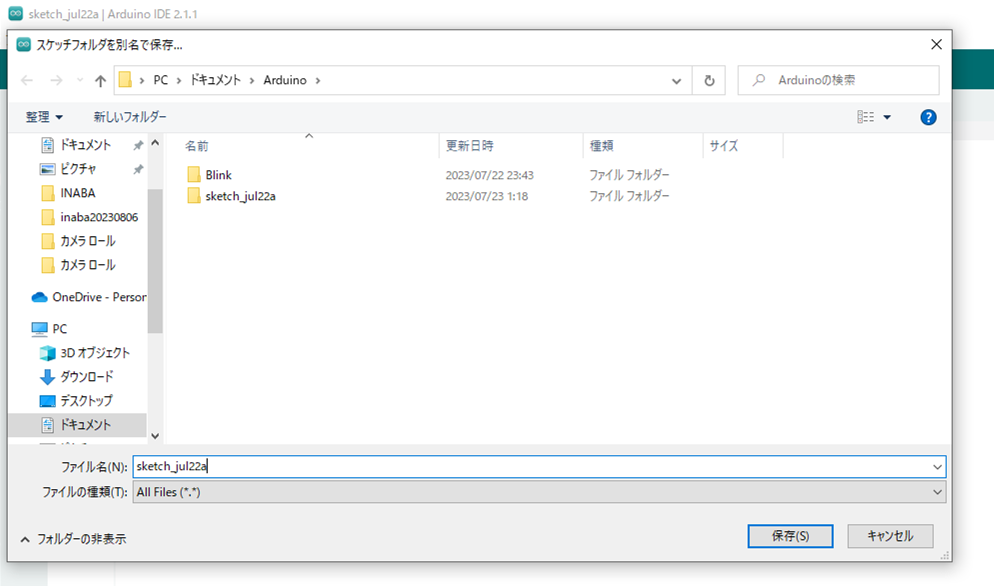

>スケッチ(プログラムコード)はそのままマイコンに書き込まれるわけではありません。
テキストで書かれたスケッチは、Arduino IDEによってマイコンの内部形式に変換され書き込まれます。内部形式から元のスケッチに変換することはできませんので、あとでプログラムを変更したくなったとしても、スケッチが保存されていなければ、変更できません。

### スケッチの読み込み

保存してあるスケッチ(プログラムコード)を読み込んで、続きのさ作業を行う場合、メニューの「開く...」から、保存場所にある.ino(拡張子が.ino)のファイルを読み込みます。

スケッチを保存すると、フォルダを作って関連するファイルなどを保存するようになっていますが、開く時には.inoのファイルを選択します。

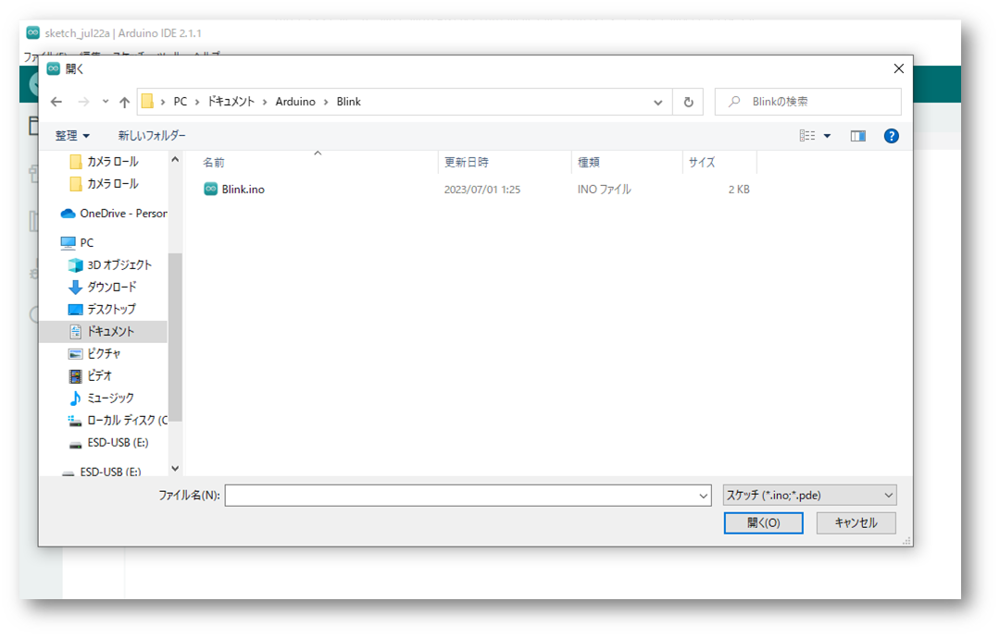

## 備忘録

### USBシリアルドライバの更新

**注意**
必要がなければ「USBシリアルドライバ」の更新は行わないでください。備忘録として、ここに記載しています。

Arduinoのプログラミングは、マイコンをUSBケーブルでパソコンに接続して行います。
その時、WindowsにはマイコンをUSBで扱うためのドライバというものが必要になります。
通常、Arduino IDEをセットアップすると必要奈ドライバも一緒にセットアップされるの特に気にする必要はありませんが、まれに、そのドライバがWindowsでうまく動作しない場合があります。（たまにWindows Updateの影響などで動かなくなる場合があります）

Arduino 互換として売られているマイコンボードには様々な種類があり、利用するボードによっては標準でセットアップされた「USBシリアルドライバ」がうまく動かない場合があります。
（中国製の安価な互換ボードの場合よくありがち）
このような場合も、Arduino IDEとは別にシリアルドライバのインストールが必要になる場合があります。

いずれの場合も、ケースバイケースで、万能な対策はありませんが、大抵の場合、解決方法は公開されていますので、インターネットで情報を検索してみてください。

